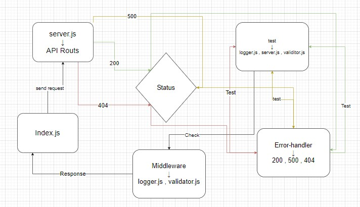

# basic-express-server

## Lab class02-401

**Links**
- [pr](https://github.com/wijdankhaled/basic-express-server/pull/1)

- [heroku](https://basicserverwijdan.herokuapp.com/)

    **UML DIGRAM**

    